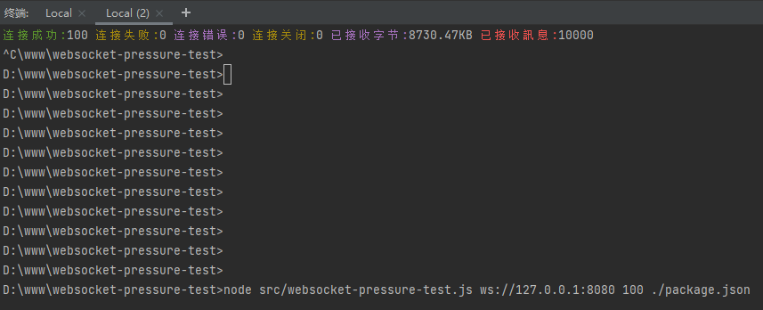

# websocket-pressure-test

nodejs版的websocket压力测试工具

### 安装

```shell
npm i websocket-pressure-test
```

### 服务

提供一个简单的本地websocket服务 地址为 `ws://127.0.0.1:8080`  


```shell
./node_modules/.bin/websocket-server
```


### 运行

./node_modules/.bin/websocket-pressure-test 地址 并发数 发送内容.json[可选]

```shell
./node_modules/.bin/websocket-pressure-test ws://127.0.0.1:8080 10000 ./node_modules/websocket-pressure-test/package.json

```



如果您是用的是win命令行:

```shell
node .\node_modules\websocket-pressure-test\src\websocket-pressure-test.js ws://127.0.0.1:8080 10000
```


### 参与贡献

1. fork 当前库到你的名下
2. 在你的本地修改完成审阅过后提交到你的仓库
3. 提交 PR 并描述你的修改，等待合并

### License

[LICENSE](LICENSE)


